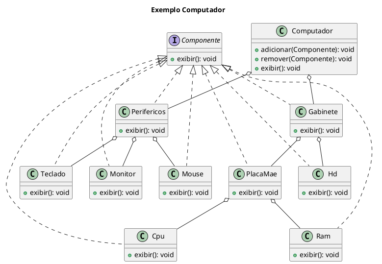
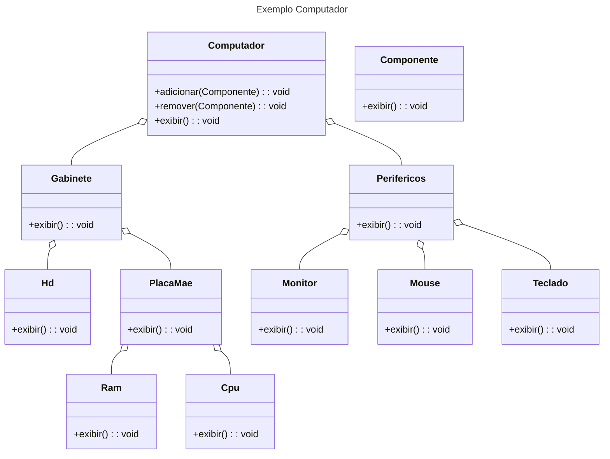

---
export_on_save:
  html: true
---

# Equipe Singleton

## Padrão de Projeto Estrutural Composite 
Intenção :

    permitir a composição de objetos em estruturas de árvores para tratamento de cada estrutura como se fossem objetos individuais.

Motivação:

    Permitir a criação de obejtos complexos a partir de componentes simples. 
    O cliente não precisa fazer a distinção entre objetos primitivos e recipientes pois a composição recursiva o faz.

Aplicabilidade:

    Deve-se utilizar o Composite quando os clientes queiram tratar dos objetos de forma uniforme na estrutura que é composta. Ou quando se queira representar hierarquias parte-todo;

Contexto:

    Podemos exemplificar a utilização deste padrão estrutural quando o nosso cenário é um computador. Nisso, cada parte microscopica (componentes, subcomponentes) faz parte do todo - a estrutura macro que é o proprio computador. 
    O composite fica explicito quando por exemplo, nós temos um cabinete, que é composto por um HD e uma Placa - Mãe, dentro dela, nos temos a RAM e a CPU. Logo, os objetos folhas são as estruturas micrioscopicas que são finais na estrutura hierarquica do computador.

[Markdown]

### Diagramas do contexto 
## Plantuml

## Mermaid

## Códigos do Contexto

### Interface

@import "./src/ExemploComputador/model/Computador.java"

## Composite Computador

@import "src/ExemploComputador/model/CompositeComputador.java"

### Composites

@import "src/ExemploComputador/model/Gabinete.java"

@import "src/ExemploComputador/model/PlacaMae.java"

@import "src/ExemploComputador/model/Perifericos.java"

### Folhas 

@import "src/ExemploComputador/model/Cpu.java"

@import "src/ExemploComputador/model/Hd.java"

@import "src/ExemploComputador/model/Monitor.java"

@import "src/ExemploComputador/model/Mouse.java"

@import "src/ExemploComputador/model/Ram.java"

@import "src/ExemploComputador/model/Teclado.java"

### Main

@import "src/ExemploComputador/model/Main.java"

[Mermaid Class Diagram](https://mermaid.js.org/syntax/classDiagram.html)

## Markdown Preview Enhanced

[Markdown Preview Enhanced](https://shd101wyy.github.io/markdown-preview-enhanced/#/)

### HTML Export

[html-export](https://shd101wyy.github.io/markdown-preview-enhanced/#/html?id=html-export)

Right click at the preview, click HTML tab.
Then choose:

HTML (offline) Choose this option if you are only going to use this html file locally.
HTML (cdn hosted) Choose this option if you want to deploy your html file remotely.

