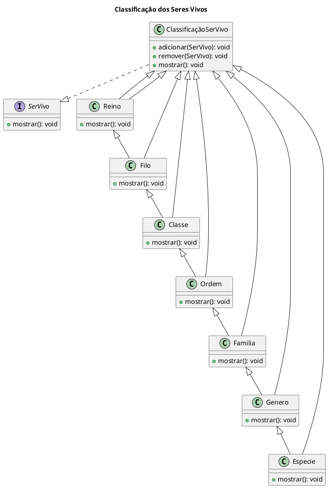
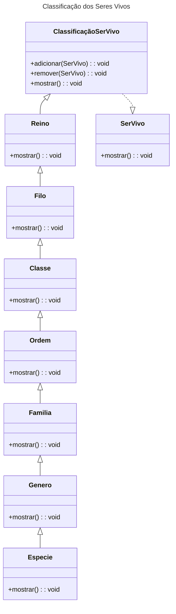
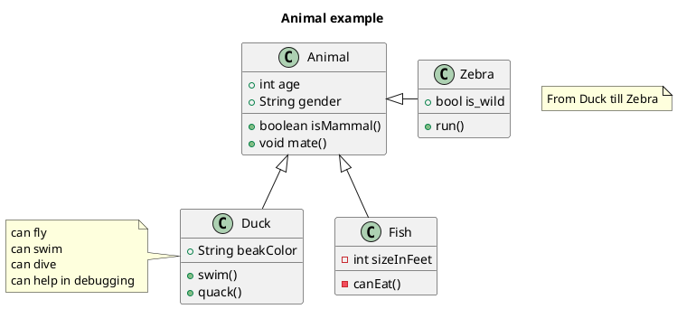
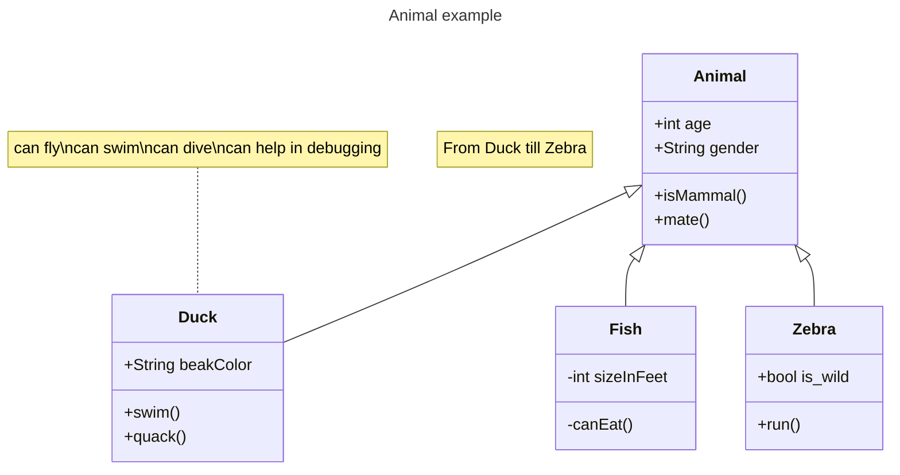

---
export_on_save:
  html: true
---

# Equipe Singleton

## Padrão de Projeto Estrutural Composite 
Intenção :

    permitir a composição de objetos em estruturas de árvores para tratamento de cada estrutura como se fossem objetos individuais.

Motivação:

    Permitir a criação de obejtos complexos a partir de componentes simples. 
    O cliente não precisa fazer a distinção entre objetos primitivos e recipientes pois a composição recursiva o faz.

Aplicabilidade:

    Deve-se utilizar o Composite quando os clientes queiram tratar dos objetos de forma uniforme na estrutura que é composta. Ou quando se queira representar hierarquias parte-todo;

Contexto:

    Classificar biologicamente os seres vivos em uma estrutura hierárquica. Para isso cada nível da hierarquia representa um elemnto individual, espécie por exemplo, ou um grupo que contenha varias espécies, uma filo.
    As classes, Animalia, Chordata, Mamalia... representam, cada uma delas, as folhas (elas são elementos individuais que não contêm outros seres vivos). 
    Já a classe ClassificaçãoSerVivo pode conter tanto indivíduos quanto grupos já estabelecidos, formando um conjunto.

### Diagramas do contexto 
### Plantuml

### Mermaid

[Markdown]
### Outro exemplo
### Plantuml

### Mermaid

[Mermaid Class Diagram](https://mermaid.js.org/syntax/classDiagram.html)

## Markdown Preview Enhanced

[Markdown Preview Enhanced](https://shd101wyy.github.io/markdown-preview-enhanced/#/)

@import "src/Classe.java"

### HTML Export

[html-export](https://shd101wyy.github.io/markdown-preview-enhanced/#/html?id=html-export)

Right click at the preview, click HTML tab.
Then choose:

HTML (offline) Choose this option if you are only going to use this html file locally.
HTML (cdn hosted) Choose this option if you want to deploy your html file remotely.

